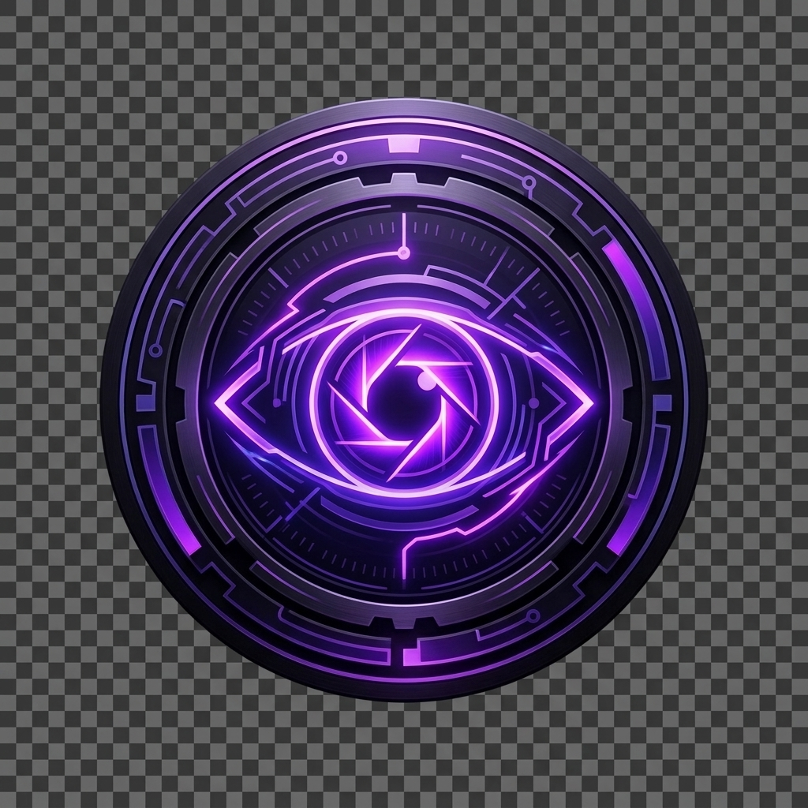

<p align="center">
  
</p>

<h1 align="center">🔒 Invisible AI Overlay — Stealth Assistant Engine</h1>

<p align="center">
  
  
  
  
</p>

A highly optimized, completely invisible, floating AI assistant designed for **Windows 10 and Windows 11**. It sits transparently on top of your workspace and offers latency-free assistance, hardware-level typing simulation, real-time screen scanning, live interview intelligence, and multi-provider AI support — all with **zero footprint** and **zero screen-capture visibility**.

---

## 🌟 Complete Feature Catalog

### 1. 🔒 Strict Stealth Mode (Zero Capture & Focus Detection)
* **Anti-Screen Capture (`WDA_EXCLUDEFROMCAPTURE`):** Leveraging the native Win32 `SetWindowDisplayAffinity` API, the window is rendered 100% black/invisible to OBS, Discord, screenshots, and automated exam proctoring tools.
* **Bypassed Focus Triggers (`WS_EX_NOACTIVATE`):** Running with strict Win32 extended window styles means clicking on the overlay never steals active focus from your foreground browser window.
* **Stealth Click Routing (`WH_MOUSE_LL`):** A low-level hardware mouse hook intercepts clicks when hovering over active settings widgets, handles them internally, and blocks them from notifying the OS. The active web page remains focused without triggering `mouseleave` or blur events.
* **Theme-less Transparent Dock Bar:** When minimized to the edge, the overlay collapses into a thin, glassy border indicator that bypasses theme styles, keeping it entirely non-descript and transparent.

---

### 2. 👻 Ghost / Background Click-Through Mode *(New in v5)*
* **Instant Click-Through on Launch:** When saved focus mode is **Background**, the overlay starts as a true 100% click-through ghost window immediately — no toggling required.
* **True WS_EX_TRANSPARENT:** Uses `WS_EX_TRANSPARENT | WS_EX_LAYERED | WS_EX_NOREDIRECTIONBITMAP` Win32 styles applied at the OS level, so all mouse events pass straight through the overlay to the window below (browser, IDE, document).
* **Undetectable:** The ghost window is physically invisible to the OS event system. Clicks on transparent regions pass directly to the application behind it.
* **Overlay Buttons Still Work:** Interactive UI buttons (chat send, settings, etc.) remain fully clickable while transparent background regions are completely pass-through.

---

### 3. 🎙️ Live Interview Mode — AI-Powered Real-Time Assistance *(New in v5)*
* **Continuous Screen Vision:** Uses `mss` for in-memory, disk-less frame capture at 1920px fidelity — no files written to disk.
* **Voice Dictation Thread:** A parallel worker listens to the interviewer's microphone in real time. Transcribed audio is passed alongside the screen image to the vision AI for full-context understanding.
* **Smart Question Detection:** The vision AI (Llama 3.2 Vision via Groq or NVIDIA NIM) detects:
  - 📝 **Code comments** describing a task (e.g., `# find biggest prime number`)
  - 🔧 **Undefined / incomplete function signatures** (e.g., `def solve(nums):` with no body)
  - 💬 **Verbal questions** from the interviewer transcribed via microphone
  - 📋 **On-screen problem statements** from coding test platforms
* **Multi-Approach Solutions:** For every detected coding problem, the AI generates two or more implementation approaches (Iterative vs Recursive), each in a clean code block with developer-style comments.
* **Behavioral Question Support:** Handles HR/behavioral questions with confident, professional spoken-style responses.
* **TTS Narration:** If speaker voice is enabled, the answer is read aloud — fully hands-free.
* **Auto-Restart Listening:** On silence or timeout, the dictation worker auto-restarts within 100ms.
* **Live Preview Popup:** A floating preview panel shows scanning status and updates in real time.
* **NO_QUESTION Guard:** Strict prompt engineering ensures the AI never hallucinates fake questions.

---

### 4. ⚡ Performance & Code Optimization *(Improved in v5)*
* **In-Memory Screen Capture:** Replaced disk-based screenshot saving with direct in-memory BGRA → RGB → JPEG conversion using `mss` + `Pillow`. Zero disk I/O during interview scanning.
* **On-Demand Hit Testing:** Resource-heavy 50Hz polling timers replaced with pure event-driven hooks. CPU stays at ~0% at rest.
* **Asynchronous UI Loading:** Settings panel opens instantly. API quota stats and model fetching run in deferred `QTimer.singleShot` threads.
* **Eliminated Duplicate Code:** Redundant polling loops, duplicate timer registrations, and re-used variable allocations removed.
* **Zero Decompression Lag:** UPX compression disabled in PyInstaller to prevent the ~2-second boot delay.

---

### 5. 🛡️ Hardware Ghost Typing (Anti-Clipboard Detection)
* **Real Hardware Simulation:** Types responses character-by-character into the active window using Windows kernel `SendInput` events with `KEYEVENTF_UNICODE`.
* **Site Bypass:** Emulates direct physical keystrokes — cannot be blocked by browsers that disable copy-paste or monitor the clipboard.

---

### 6. 📊 Active Quota & Reset Tracker
* **Remaining Usability Count:** Tracks daily request usage against standard caps:
  * **Gemini (Free tier):** 1,500 daily requests
  * **Groq:** 14,400 daily requests
  * **OpenRouter (Free endpoints):** 200 daily requests
  * **NVIDIA (Nemotron credits):** 1,000 daily requests
* **Reset Countdown:** Shows exact time remaining until the midnight UTC quota reset boundary.

---

### 7. 📡 Dynamic Working Model Fetcher
* **Live Refresh:** Queries the active provider APIs to pull the list of currently working online models.
* **Filter Heuristics:** Automatically filters out Whisper/voice-transcription models, so only valid text/code-generation models appear in dropdowns.

---

## 🎹 Keyboard Shortcuts & Command Mode

Press **`Alt + Z`** to enter **Command Mode**, then:

| Hotkey | Action |
| :--- | :--- |
| **`Esc`** | Deactivate Command Mode |
| **`Space`** / **`H`** | Toggle visibility (minimize/dock or restore) |
| **`K`** | Toggle Ghost Typing / Typist Mode |
| **`P`** | Rotate AI Provider (Gemini ⇄ Groq ⇄ OpenRouter ⇄ NVIDIA) |
| **`S`** | Scan Screen → send to Gemini Vision |
| **`I`** | Inject latest AI code block via hardware keystrokes |
| **`1-9`** | Inject specific indexed code block |
| **`D`** | Send Chat Message |
| **`C`** | Clear chat history |
| **`T`** | Toggle Light / Dark Theme |
| **`U`** | Single Voice Input |
| **`M`** | Toggle Continuous Dictation Mode |
| **`V`** | Toggle Speaker TTS Mute / Unmute |
| **`O`** | Rotate TTS Voice Model |
| **`L`** | Launch / Stop Live Interview Mode |
| **`X`** | Force Exit |
| **`▲ / ▼ / ◀ / ▶`** | Reposition Overlay by 20px |

---

## ⚙️ Settings Guide

Open via the **Settings** button in the sidebar:

* **API Keys:** Inputs for Gemini, Groq, OpenRouter, and NVIDIA keys with 👁️ toggle view, 📋 paste, and 🔑 reset.
* **Model Dropdowns:** Pre-populated with standard models; use **📡 Fetch Models** to refresh live.
* **💾 Save Config:** Saves models, keys, and position metrics.

---

## 🛡️ Anti-Detection Guidelines

1. **Never Drag and Drop Text** — fires detectable browser events. Use OCR scanning (`Alt + Z` → `S`).
2. **Never use mouse to reposition** — use `Alt + Z` + Arrow Keys instead.
3. **Use Background Mode** — overlay stays click-through and never takes focus.
4. **Clean Reset** — use 🔑 Reset Keys on shared computers to erase personal API key traces.

---

## 🚀 Build & Self-Sign (Windows 10 / 11)

### Why this build is recognized as clean:
1. **Disguised Binary Name:** Named `SystemAudioEngine.exe` — system-neutral, invisible in Task Manager.
2. **UPX Disabled:** Avoids packer heuristics flagged by AV tools.
3. **PE Metadata Embedded:** `file_version_info.txt` injects authentic Company Name, Version, and Copyright into PE headers.
4. **Local Authenticode Self-Signing:** Signed with a locally-generated certificate trusted by the machine.

### How to Build:
```bat
.\build_exe.bat
```
1. Activates `.venv`, compiles via PyInstaller with `--icon=overlay_icon.ico --noconsole --onefile`.
2. Detects the newest version folder in `dist\`, moves the `.exe` to `release\SystemAudioEngine.exe`.
3. Automatically runs `self_sign.ps1` as Administrator to sign the binary.
4. The signed executable launches without SmartScreen warnings.
