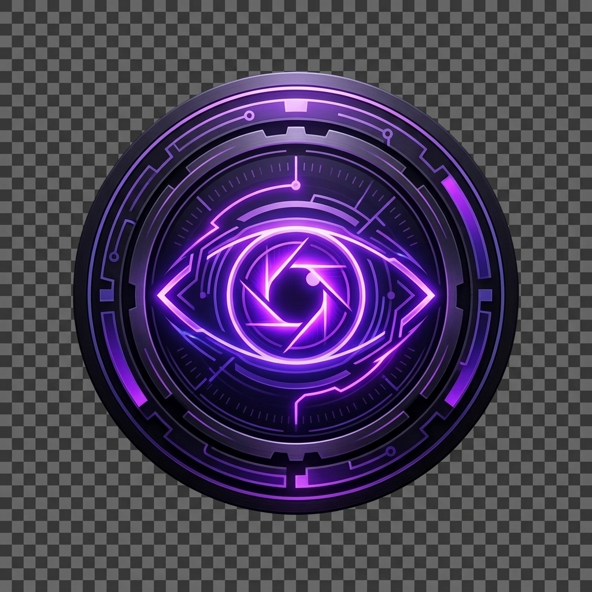
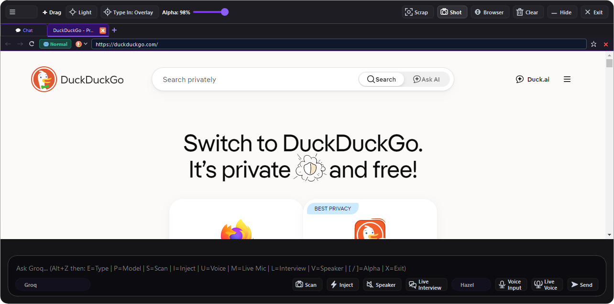
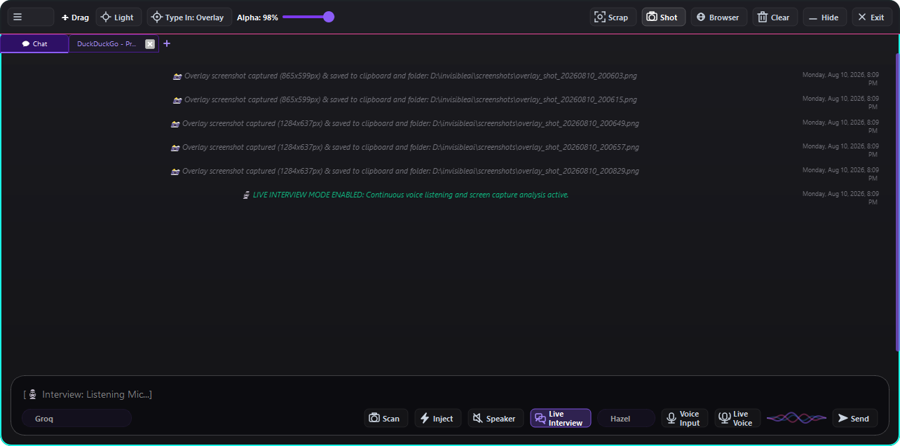

<p align="center">
  
</p>

<h1 align="center">🔒 Invisible AI Overlay — Stealth Assistant Engine</h1>

<p align="center">
  
  
  
  
  
</p>

A highly optimized, completely invisible, floating AI assistant designed for **Windows 10 and Windows 11**. It sits transparently on top of your workspace and offers latency-free assistance, hardware-level typing simulation, real-time screen scanning, live interview intelligence, natural voice command parsing, and multi-provider AI support — all with **zero footprint**, **instant sub-second startup**, and **zero screen-capture visibility**.

---

## 📸 Screenshots Showcase

<p align="center">
  
  <br/>
  <i>Invisible AI Overlay — Floating Dark Mode HUD with Live Voice Command Badges & Opacity Controls</i>
</p>

<p align="center">
  
  <br/>
  <i>Embedded Dual-Mode Chromium Browser — Persistent Normal Mode vs Zero-Trace Incognito Mode</i>
</p>

<p align="center">
  
  <br/>
  <i>Settings Panel — Color-Coded Event Logs, API Key Management, and Quota Trackers</i>
</p>

---

## ⌨️ Complete Hotkeys & Shortcuts Cheatsheet

### 🌐 Global Direct Hotkeys (Work Anywhere in Windows)

| Hotkey | Action / Feature | Description |
| :--- | :--- | :--- |
| **`Alt + Z`** | **Toggle Command Leader Mode** | Activates single-key command mode for rapid keyboard navigation. |
| **`Alt + /`** | **Print Hotkey Cheatsheet** | Generates an interactive hotkeys and voice commands directory card in chat. |
| **`Alt + I`** | **Inject Target Code** | Injects generated AI response directly into your active code editor window. |
| **`Alt + S`** | **Screen Snipe / Vision OCR** | Crops any screen region to extract code, math formulas, or questions into AI context. |
| **`Alt + W`** | **Toggle Embedded Browser** | Opens or hides the built-in stealth Chromium web browser. |
| **`Alt + B`** | **Focus Browser Address Bar** | Highlights address bar to instantly type URLs or search queries. |
| **`Alt + F`** | **Toggle Focus Mode** | Cycles overlay focus states (Normal ➔ Background Ghost ➔ Full Stealth). |
| **`Alt + P`** | **Cycle AI Model Provider** | Rotates active LLM providers (Groq Llama 3.3 ➔ Gemini 3.5 ➔ NVIDIA ➔ Web2API). |
| **`Alt + M`** | **Voice Command Center** | Toggles continuous background microphone listening for natural voice controls. |
| **`Alt + U`** | **Voice Typist Engine** | Transcribes your spoken mic speech directly into hardware typed text. |
| **`Alt + V`** | **Speaker Voice (TTS)** | Toggles text-to-speech audio narration of AI answers. |
| **`Alt + L`** | **Live Interview Mode** | Enables continuous Vision + Mic scanning for real-time technical interviews. |
| **`Alt + H`** | **Hide / Show Window** | Instantly toggles overlay visibility without closing the app. |
| **`Alt + R`** | **Reset Window Layout** | Resets window position, dimensions, and opacity to factory default defaults. |
| **`Alt + Esc`**| **Panic Emergency Hide** | Instantly hides window, silences TTS, and stops all background workers. |

---

### ⚡ Command Mode Single-Key Leader Commands (`Alt + Z` then Key)

Press **`Alt + Z`**, then hit any of these single keys:

| Key | Function | Description |
| :---: | :--- | :--- |
| **`Space` / `H`** | Hide / Show | Toggles overlay window visibility. |
| **`S`** | Screen Snipe | Triggers interactive screen cropper for vision analysis. |
| **`I`** | Inject Target | Injects last AI code response into active window. |
| **`K` / `T`** | Type Mode | Hardware character-by-character typing into target app. |
| **`P`** | Cycle Provider | Switches active LLM provider. |
| **`O`** | Voice Input | Toggles continuous mic voice listening. |
| **`U`** | Voice Typist | Toggles dictation-to-typing engine. |
| **`M`** | Live Mic | Toggles interviewer microphone capture. |
| **`L`** | Live Interview | Starts real-time screen + voice interview solver. |
| **`V`** | Speaker Voice | Toggles TTS speech output. |
| **`W`** | Open Browser | Toggles stealth Chromium mini browser. |
| **`B`** | Address Bar | Focuses browser URL bar. |
| **`E`** | Focus Chat | Focuses chat prompt input box. |
| **`F`** | Focus Mode | Cycles window click-through stealth state. |
| **`T`** | Change Theme | Rotates UI color themes (Dark Glass, Cyber Neon, Stealth Black). |
| **`C`** | Clear Chat | Clears chat feed conversation history. |
| **`D`** | Send Chat | Sends current typed chat prompt. |
| **`?`** | Print Directory | Prints complete cheatsheet card to chat. |
| **`X`** | Exit Application | Closes Invisible AI Overlay completely. |

---

## 🗣️ Natural Voice Commands Dictionary

Speak these commands naturally into your microphone (or type them into the chat input):

| Spoken / Typed Intent | Triggered Action |
| :--- | :--- |
| **`"type code"`** / **`"type response"`** | Hardware types response character-by-character into target window. |
| **`"inject target"`** / **`"inject code"`** | Injects generated solution into active code editor. |
| **`"snip screen"`** / **`"scan screen"`** | Launches screen snippet cropper for Vision OCR understanding. |
| **`"open browser"`** / **`"show browser"`** | Opens or toggles embedded Chromium browser tab. |
| **`"clear chat"`** / **`"reset chat"`** | Clears active conversation history. |
| **`"use groq"`** | Switches active AI model provider to **Groq Llama 3.3**. |
| **`"use gemini"`** | Switches active AI model provider to **Google Gemini 3.5 Flash**. |
| **`"use nvidia"`** | Switches active AI model provider to **NVIDIA Nemotron / Llama 3.1**. |
| **`"use web2api"`** | Switches active AI model provider to **Web2API Local Endpoint**. |
| **`"print hotkeys"`** / **`"help"`** | Posts full cheatsheet directory card into the chat feed. |
| **`"panic"`** / **`"emergency hide"`** | Triggers emergency window hide and stops all audio playback. |

---

## 📦 How to Download & Run Pre-Built Release (No Python Needed!)

If you want to run Invisible AI Overlay on any Windows 10 or Windows 11 PC without installing Python, Git, or dependencies:

1. **Download the Zip Archive:**
   * Download directly: [SystemAudioEngine_v10_Portable.zip](https://github.com/pmunaswamireddy/Invisible-ai/releases/download/version10/SystemAudioEngine_v10_Portable.zip) or visit [GitHub Releases](https://github.com/pmunaswamireddy/Invisible-ai/releases/tag/version10).
2. **Extract the Zip:**
   * Right-click `SystemAudioEngine_v10_Portable.zip` ➔ **Extract All...** to any folder (e.g. `C:\InvisibleAI`).
3. **Launch Immediately (< 0.5s):**
   * Double-click **`SystemAudioEngine.exe`** inside the extracted folder.
   * The overlay launches **instantly in under 0.5 seconds**!

---

## 🛠️ Quick Start & Build Instructions

### 1. Run from Source (1-Click Auto Setup):
```bat
.\start.bat
```

### 2. Build Instant Executable (`dist/v10`):
```bat
.\build_exe.bat
```
Generates the instant sub-second startup directory executable at `dist/v10/SystemAudioEngine/SystemAudioEngine.exe`.

### 3. Auto-Sign Executable (Bypass SmartScreen):
```powershell
.\self_sign.ps1 -exePath dist/v10/SystemAudioEngine/SystemAudioEngine.exe
```

---

<p align="center">
  <b>Invisible AI Overlay v10.0</b> — Built with Python, PyQt5, Chromium & Win32 Ctypes
</p>
